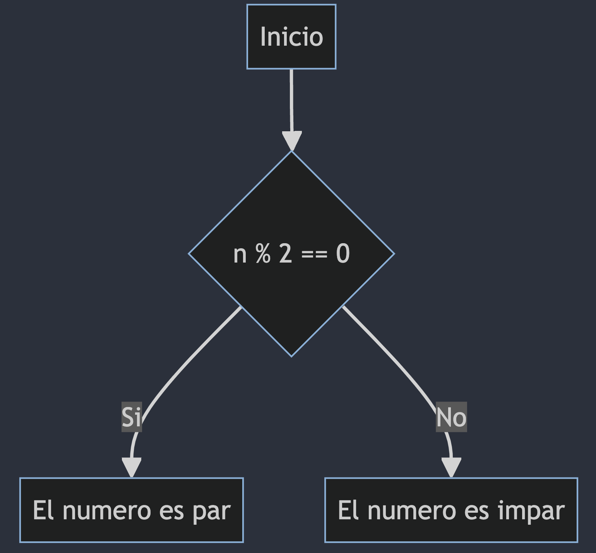
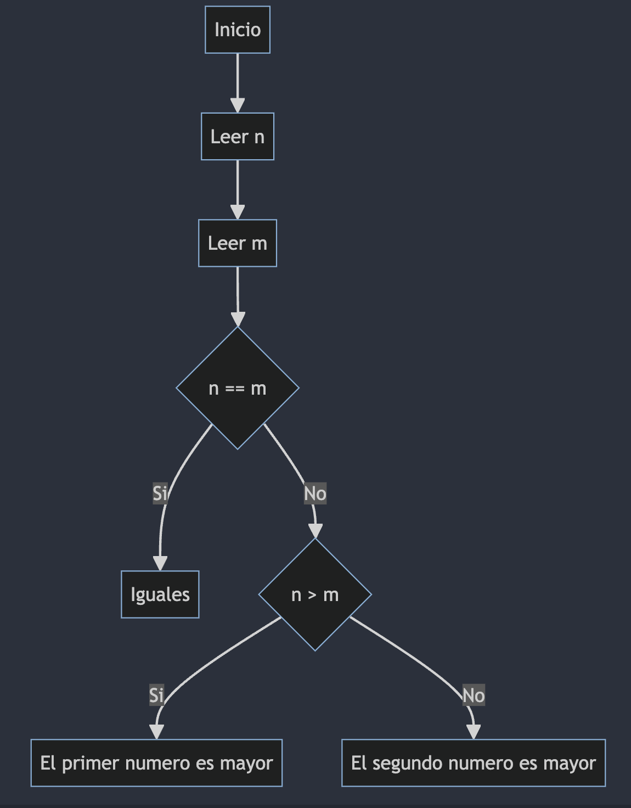
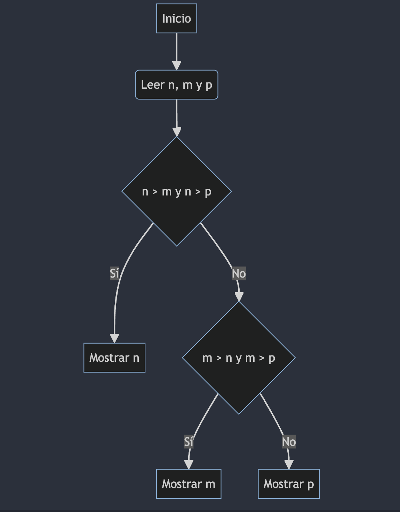

# Condicionales en Java

Los condicionales son una estructura de control que nos permite tomar decisiones en un programa. En Java, los condicionales se implementan con la estructura `if-else`. La estructura `if-else` nos permite ejecutar un bloque de código si se cumple una condición, y otro bloque de código si no se cumple la condición.

## Estructura de un condicional

La estructura de un condicional en Java es la siguiente:

```java
if (condicion) {
    // Bloque de código si la condición es verdadera
} else {
    // Bloque de código si la condición es falsa
}
```

La palabra `if` es una palabra reservada en Java que indica el inicio de un condicional. La condición es una expresión que se evalúa a verdadero o falso. Si la condición es verdadera, se ejecuta el bloque de código que está dentro de las llaves `{}`. Si la condición es falsa, se ejecuta el bloque de código que está dentro de las llaves `{}` que están después de la palabra `else`.

## Ejemplo

El siguiente programa lee un número entero e imprime si el número es par o impar.

```java
import java.util.Scanner;

public class Main {
    public static void main(String[] args) {
        Scanner sc = new Scanner(System.in);
        int n = sc.nextInt();
        if (n % 2 == 0) {
            System.out.println("El número es par");
        } else {
            System.out.println("El número es impar");
        }
    }
}
```

### Diagrama de flujo

El siguiente diagrama de flujo muestra el funcionamiento de un condicional en Java.



## Condicionales anidados

Un condicional anidado es un condicional dentro de otro condicional. Los condicionales anidados nos permiten tomar decisiones más complejas en un programa. En Java, los condicionales anidados se implementan con la estructura `if-else` dentro de otro `if` o `else`.

### Ejemplo

El siguiente programa lee dos números enteros e imprime si son iguales, si el primero es mayor que el segundo, o si el segundo es mayor que el primero.

```java
import java.util.Scanner;

public class Main {
    public static void main(String[] args) {
        Scanner sc = new Scanner(System.in);
        int n = sc.nextInt();
        int m = sc.nextInt();
        if (n == m) {
            System.out.println("Iguales");
        } else {
            if (n > m) {
                System.out.println("El primer número es mayor");
            } else {
                System.out.println("El segundo número es mayor");
            }
        }
    }
}
```

### Diagrama de flujo

El siguiente diagrama de flujo muestra el funcionamiento de un condicional anidado en Java.




## Else if

La estructura `else if` nos permite evaluar múltiples condiciones en un condicional. En Java, la estructura `else if` se implementa con la palabra `else` seguida de la palabra `if` y una condición.

### Ejemplo

El siguiente programa lee tres números enteros e imprime el mayor de ellos.

```java
import java.util.Scanner;

public class Main {
    public static void main(String[] args) {
        Scanner sc = new Scanner(System.in);
        int n = sc.nextInt();
        int m = sc.nextInt();
        int p = sc.nextInt();
        if (n > m && n > p) {
            System.out.println(n);
        } else if (m > n && m > p) {
            System.out.println(m);
        } else {
            System.out.println(p);
        }
    }
}
```

### Diagrama de flujo

El siguiente diagrama de flujo muestra el funcionamiento de un condicional con `else if` en Java.

