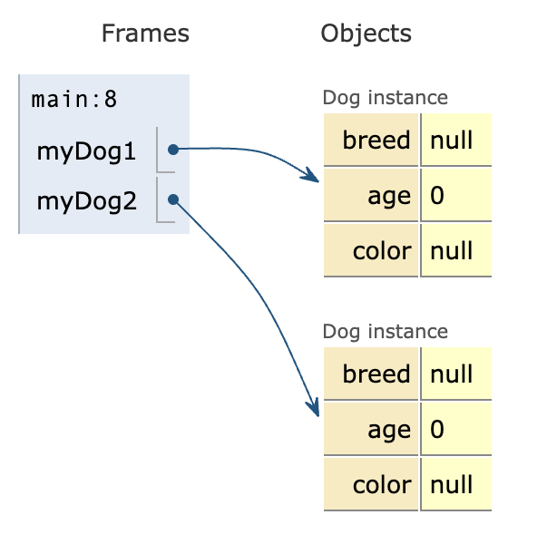
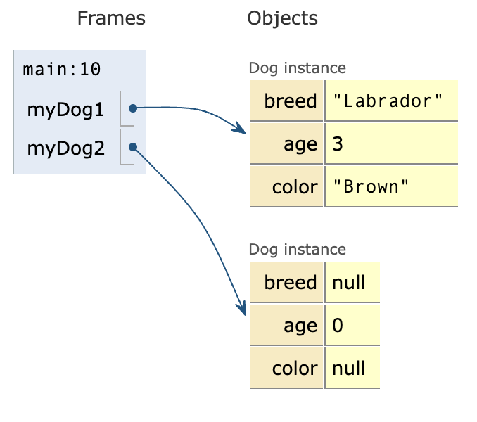

# Programación Orientada a Objetos

La programación orientada a objetos (POO) es un paradigma de programación que utiliza objetos y sus interacciones para diseñar aplicaciones y programas informáticos. Está basado en varias técnicas, incluyendo herencia, abstracción, polimorfismo, encapsulamiento y modularidad.

## Clases y Objetos

Una clase es una plantilla para crear objetos. Un objeto es una instancia de una clase.

### Ejemplo

```java
public class Dog {
    // atributos
    String breed;
    int age;
    String color;
    // metodos
    void barking() {
    }
    void hungry() {
    }
    void sleeping() {
    }
}
```
Los atributos son variables dentro de una clase. Representan características del objeto.

Los métodos son funciones dentro de una clase. Representan comportamientos del objeto.

## Instanciación

La instanciación es el proceso de crear un objeto a partir de una clase.

### Ejemplo

```java
Dog myDog1 = new Dog();
Dog myDog2 = new Dog();
```

Donde `myDog1` y `myDog2` son objetos de la clase `Dog`. La palabra `new` se utiliza para crear un nuevo objeto y Dog() es el constructor de la clase `Dog`. En este ejemplo estamos creando dos objetos de la clase `Dog` usando como plantilla la clase `Dog`.



Para acceder a los atributos y métodos de un objeto se utiliza el operador punto `.`

### Ejemplo

```java
myDog1.breed = "Labrador";
myDog1.age = 3;
myDog1.color = "Brown";
```

Debemos recordar que cada objeto tiene su propia copia de los atributos y métodos de la clase.



Podemos ver que al acceder a los atributos de `myDog1` y `myDog2` estamos accediendo a diferentes valores.
## Metodos

Un método es una función dentro de una clase que define el comportamiento de un objeto.

### Ejemplo

```java

public class Dog {
    void barking() {
        System.out.println("Woof");
    }
    void hungry() {
        System.out.println("Feed me");
    }
    void sleeping() {
        System.out.println("Zzz");
    }
}
```

En este ejemplo, `barking`, `hungry` y `sleeping` son métodos de la clase `Dog`. Cada uno de ellos define un comportamiento de un objeto de la clase `Dog`.

Los métodos pueden recibir parámetros y devolver un valor.

### Ejemplo

```java

public class Calculator {
    int add(int a, int b) {
        return a + b;
    }
    int subtract(int a, int b) {
        return a - b;
    }
    int multiply(int a, int b) {
        return a * b;
    }
    int divide(int a, int b) {
        return a / b;
    }
}
```

En este ejemplo, `add`, `subtract`, `multiply` y `divide` son métodos de la clase `Calculator`. Cada uno de ellos recibe dos parámetros y devuelve un valor.

Por ejemplo el metodo `add` tiene la palabra `int` antes del nombre del método. Esto significa que el método devuelve un valor de tipo `int`. Si el método no devuelve ningún valor, se utiliza la palabra `void`.

## Constructores

Un constructor es un método especial que se llama cuando se crea un objeto de una clase. Su nombre es el mismo que el de la clase y no tiene un tipo de retorno.

### Ejemplo

```java
public class Dog {
    String breed;
    int age;
    String color;
    Dog(String breed, int age, String color) {
        this.breed = breed;
        this.age = age;
        this.color = color;
    }
}
```
La palabra `this` se utiliza para referirse a los atributos de la clase. Esto lo hacemos para evitar ambigüedades entre los atributos y los parámetros del constructor.

Que pasaria si no usamos `this`?

```java
public class Dog {
    String breed;
    int age;
    String color;
    Dog(String breed, int age, String color) {
        breed = breed;
        age = age;
        color = color;
    }
}
```

En este caso, el compilador no sabría si `breed` se refiere al atributo de la clase o al parámetro del constructor. Por eso usamos `this` para referirnos a los atributos de la clase.

## Encapsulamiento

El encapsulamiento es el mecanismo que restringe el acceso a ciertos componentes de un objeto, de manera que no se pueda acceder a ellos directamente desde fuera de la clase.

### Ejemplo

```java
public class Dog {
    private String breed;
    private int age;
    private String color;
    public String getBreed() {
        return breed;
    }
    public void setBreed(String breed) {
        this.breed = breed;
    }
    public int getAge() {
        return age;
    }
    public void setAge(int age) {
        this.age = age;
    }
    public String getColor() {
        return color;
    }
    public void setColor(String color) {
        this.color = color;
    }
}
```

En este ejemplo, los atributos de la clase `Dog` son privados. Esto significa que no se pueden acceder directamente desde fuera de la clase. Para acceder a ellos se utilizan los métodos `get` y `set`.

Esto lo hacemos para proteger los atributos de la clase. Si los atributos son públicos, cualquier parte del programa puede cambiarlos y esto puede llevar a errores difíciles de depurar.

En java tenemos cuatro niveles de acceso:

- `public`: Acceso desde cualquier clase.
- `protected`: Acceso desde la misma clase, clases del mismo paquete y subclases.
- `default`: Acceso desde la misma clase y clases del mismo paquete.
- `private`: Acceso solo desde la misma clase.

